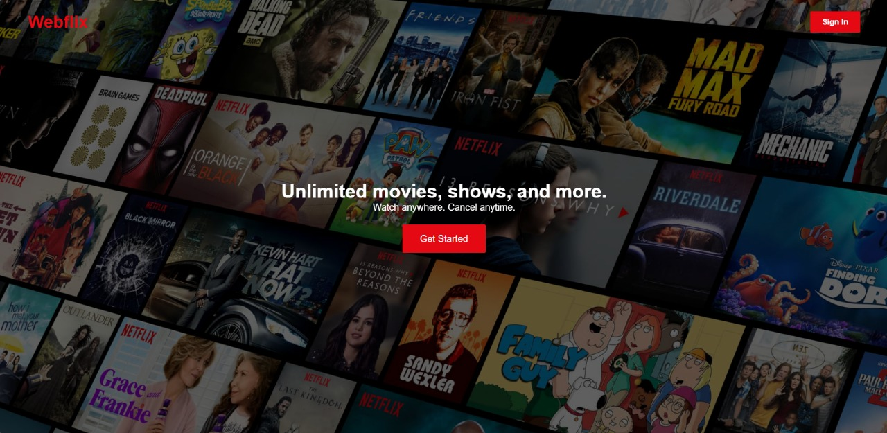
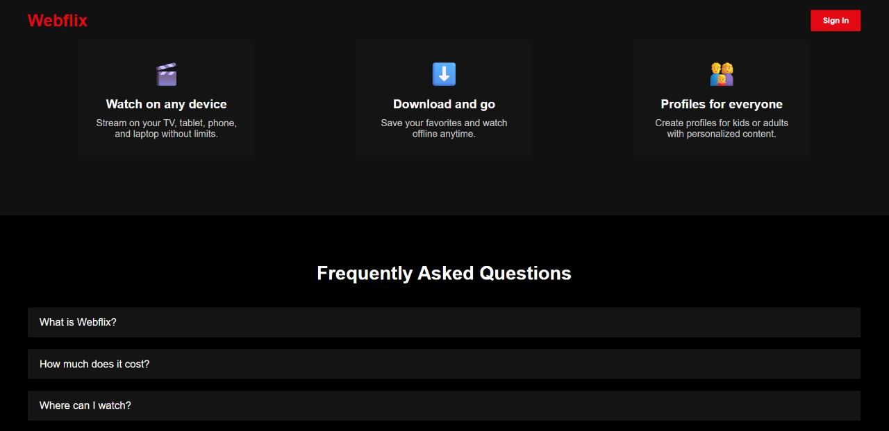
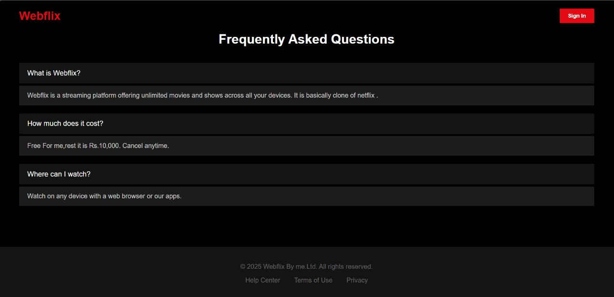

# Webflix - Netflix Style Landing Page

Webflix is a modern, minimal, desktop-only landing page inspired by Netflix. This project showcases UI/UX skills including responsive layout design, visual hierarchy, and interactive elements like FAQs.

## Demo (Screenshots)

### Hero Section

### Features Section

### Footer and FAQ Section

> Open `index.html` in your browser to view the landing page locally.

---

## Features

- **Cinematic Hero Section**: Full-screen background image with overlay and animated text.
- **Responsive Navbar**: Fixed top navigation with brand logo and Sign In button.
- **Interactive CTA**: Call-to-action button with hover effect.
- **Features Section**: Highlight key platform benefits in clean cards.
- **FAQ Section**: Expandable/collapsible questions using JavaScript.
- **Footer**: Simple footer with links and copyright.
- **Minimal Design**: Dark theme inspired by Netflix, clean typography, and subtle animations.

---

## Design Idea / Figma Prototype

The Webflix landing page design was initially conceptualized in Figma to plan layout, typography, and UI interactions before coding.

You can view the full Figma prototype here:  
[View Figma Design](https://www.figma.com/site/4MiTEiCtll2bMzlDIJ9YQY/Webflix--practice-?node-id=0-1&t=pQMoHW6j7z5cvDgU-1)

---

## Technologies Used

- **HTML5** – Structure of the page.
- **CSS3** – Styling, animations, and responsive layout.
- **JavaScript** – FAQ toggle functionality.
